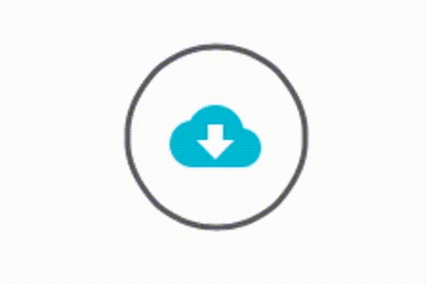

# JPCActivityIndicatorButton

ActivityIndicatorButton is an implementation of the progress control used in the App Store app and several other Apple apps. However the style is inspired by Google's material design. 

It is a drop in replacement for UIActivityIndicatorView and UIProgressView that tracks touch input like a UIButton. It may be useful in the following scenarios
* Replacement for UIActivityIndicatorView
* Replacement for UIProgressView
* Replacement for UIButton with Google Material Design styling
* To create a similar interaction as start and stopping downloads in the App Store app. 

### Default "App Store" style


### Material Design Style


There is a slight border between the progress bar and the button that I'm calling the "track" however it is hard to see in this GIF.

---

## Usage

This control may be used in Storyboard or programmically.  It is IBDesignable so you can see a preview and edit its properties directly from interface builder.  Just add a UIView and change its type to "ActivityIndicatorButton".

``` swift 
let button = ActivityIndicatorButton(frame: CGRectZero)
```

### Layout

It defines instrincContentSize based on the size of the images. So like UIButton you don't need to define its width and height (unless you want to).


### Events
It inherits from UIControl so set touch events just like you would a UIButton.

### Activity State
This defines the state of the button. 
* Inactive: In this state the control is waiting for an action to get started.
* Spinning: Activity analogous to UISpinner. Track not displayed.
* Progress: Displays a progress bar stating from midnight at 0% and moving clockwise to 100%.
* Paused:   Suspends Spinning or Progress in action.
* Complete: Show this state when the activity has completed.

### Configuration
It is pretty customizable.  Check out the Docs.  Most of its property may be set in Storyboard as well as in code.  Here's a few of the basics.

The style ("App Store" vs. Material Design in the GIFs above) is defined using the boolean "useSolidColorButtons".  Where true is Material Design style.

``` swift
button.useSolidColorButtons = true
```

Images are set based on activity state. 

``` swift
button.setImage(image: UIImage(named: "anImage"), forActivityStates: [.Spinning, .Progress])
```

So is tintColor and trackColor (the track is the circular outline just inside the progress bar. Its hard to see in the 2nd GIF)

``` swift
button.setTrackColor(UIColor.lightGrayColor(), forActivityStates: [.Spinning, .Progress])
button.setTintColor(UIColor(red: 0.298, green: 0.686, blue: 0.314, alpha: 1.0), forActivityStates: [.Complete])
```

You can also adjust animations including the touch down and touch up ripple animation.  Check out the Docs!


## Installation
### Cocoapods 

``` ruby
use_frameworks!
pod 'JPCActivityIndicatorButton'
```

### Manual
Copy ActivityIndicatorButton.swift into your project


